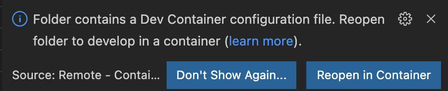

<p align="center">

</p>

# lumos: scalable optimal control for dynamical systems

[](https://github.com/numagic/lumos/actions/workflows/test_with_docker_image.yml)
[](https://github.com/numagic/lumos/actions/workflows/test_with_conda.yml)
[](https://badge.fury.io/py/numagic-lumos)
[](https://pepy.tech/project/numagic-lumos)


[**Optimal Control Example**](#optimal-control-example)
| [**Quickstart**](#quickstart-colab-in-the-cloud)
| [**Environment setup**](#environment-setup)

## What is lumos?
[**lumos**](https://github.com/numagic/lumos) is a scalable numerical framework for the modelling and simulation of dynamical systems. Currently lumos focus on optimal control problems only, but the ideas it implements can be easily extended to other problems such as parameter inferences and state estimations.

One of the core philosophies of **lumos** is to leverage some fundamental technologies that enables the deep learning revolution: namely automatic differnetiation and large scale parallelization using accelerated hardware (GPU, TPU, etc).

**lumos** adopts a numpy-like syntax to write models, and currently has two built-in backends: [JAX](https://jax.readthedocs.io/en/latest/) and [Casadi](https://web.casadi.org). In addition to the built-in backends, **lumos** is also extensible and can solve optimal control problems with user-defined custom model bakends, provided that a few necessary APIs are exposed.

## Optimal Control Example
```python
import numpy as np
from typing import Any, Dict

import lumos.numpy as lnp
from lumos.models.base import StateSpaceModel, StateSpaceModelReturn, state_space_io
from lumos.optimal_control.config import (
    BoundaryConditionConfig,
    BoundConfig,
)
from lumos.optimal_control.scaled_mesh_ocp import ScaledMeshOCP

# Create a model
@state_space_io(states=("v", "x", "y"), inputs=("theta",), outputs=("theta",))
class TimeModel(StateSpaceModel):
    """The Brachistochrone model formulatd in the time domain"""

    def __init__(
        self, model_config: Dict[str, Any] = {}, params: Dict[str, Any] = {},
    ):
        super().__init__(model_config=model_config, params=params)

    def forward(
        self,
        states: lnp.ndarray,
        inputs: lnp.ndarray,
        mesh: float,  # time invariant model
    ) -> StateSpaceModelReturn:
        theta = self.get_input(inputs, "theta")

        states_dot = self.make_vector(
            group="states_dot",
            v_dot=-self._params["gravity"] * lnp.sin(theta),
            x_dot=lnp.cos(theta) * self.get_state(states, "v"),
            y_dot=lnp.sin(theta) * self.get_state(states, "v"),
        )
        outputs = self.make_vector(group="outputs", theta=theta)
        return self.make_state_space_model_return(
            states_dot=states_dot, outputs=outputs
        )

    @classmethod
    def get_default_params(self) -> Dict[str, Any]:
        return {"gravity": 9.81}


# Set up the model and the problem
model = TimeModel()
sim_config = ScaledMeshOCP.get_sim_config(
    boundary_conditions=(
        BoundaryConditionConfig(0, "states", "x", 0.0),
        BoundaryConditionConfig(0, "states", "y", 0.0),
        BoundaryConditionConfig(0, "states", "v", 0.0),
        BoundaryConditionConfig(-1, "states", "x", 1.0),
        BoundaryConditionConfig(-1, "states", "y", -0.6),
    ),
    bounds=(
        BoundConfig("global", "mesh_scale", (0.01, 10.0)),
        BoundConfig("inputs", "theta", (-np.pi / 2, np.pi / 2)),
    ),
    num_intervals=49,
    hessian_approximation="exact",
)
ocp = ScaledMeshOCP(model=model, sim_config=sim_config)

# Solve with a trivial initial guess
solution, info = ocp.solve(
    init_guess=np.zeros(ocp.num_dec), max_iter=200, print_level=4,
)
print(f"maneuveur time: {ocp.objective(solution):.3f} seconds")
```

### Contents
* [Optimal Control Example](#optimal-control-example)
* [Quickstart: Colab in the Cloud](#quickstart-colab-in-the-cloud)
* [Envirohnment setup](#environment-setup)

## Quickstart: Colab in the Cloud
`TODO`: update the link since the notebooks only exist in the dev branch at the moment
- [Laptime simulation notebook](https://github.com/numagic/lumos/blob/dev/colab/lumos_laptime_simulation.ipynb) for optimal laptime around a race track
- [Brachistochrone notebook](https://github.com/numagic/lumos/blob/dev/colab/Brachistochrone.ipynb) of the Brachistochrone example with the end-to-end implementation with and without automatic differentiation

## Environment setup
**lumos** It is recommened to develop with lumos via two ways: using [**conda**](#setting-up-with-conda) or using [**docker environment**](#setting-up-with-docker), with the latter preferred, especially for developers as.

At the moment, **lumos** is tested and supports Python 3.7, 3.8 and 3.9.

### Setting up with conda
1) setting up the dependencies
```sh
conda create -n lumos python=3.9
conda env update -n lumos -f environment.yml
conda activate lumos
```
2) Install **lumos** from test.pypi (temporarily)
```sh
pip install -i https://test.pypi.org/simple/ numagic-lumos==0.0.5a0
```

2) Alternatively, install **lumos** from source
```sh
python3 -m pip install .
```

3) Test if it works
```sh
python3 examples/drone_example.py
```

### Setting up with docker

1) you can directy build the local dev container with:
```sh
docker-compose build --build-arg UID=$(id -u) --build-arg GID=$(id -g)
```

2) After the docker container is build, start it with
```sh
docker-compose up -d
```
The container should now be running in the background.

3) [Optional] download and install VSCode, and then install the 'remote containers' extension.

4) once VSCode with the extensions are installed, open VSCode, and open the folder where the repo is. It should automatically recognize the container configuration file, and asks if you want to open it in an conatiner, click 'Reopen in Container'
<p align="center">

</p>


5) Once the VSCode enter the container, it will set up the other extensions and adopt settinsg defined in .devcontainer.json. After it installs the extensions, it might ask you to give permission to reload the conatiner to activate extensions like pylance language server, simply click yes.

6) at this point, you should be able to run the examples, in a conatiner, try:
```sh
(lumos) <username>@lumos_dev:~/numagic/lumos$ python3 examples/drone_example.py
```
and the simulations should run and in the end you should get something like:
```sh
Number of objective function evaluations             = 225
Number of objective gradient evaluations             = 67
Number of equality constraint evaluations            = 225
Number of inequality constraint evaluations          = 0
Number of equality constraint Jacobian evaluations   = 67
Number of inequality constraint Jacobian evaluations = 0
Number of Lagrangian Hessian evaluations             = 66
Total seconds in IPOPT                               = 3.247

EXIT: Optimal Solution Found.
INFO:__main__:Maneuver time 1.300 sec
INFO:__main__:Final theta 6.28 rad
INFO:__main__:Final sin(theta) -0.00
```

7) [FIXME] currently the python extension setting for vscode extensions (which does not affect running the code, but affects hwo the VSCode extensions work) does not work automatically using the setting in .devcontainer.json. Therefore one must manually set the interpreter for tools such as linting with flake8, and autoformatting with black to work.
6.1) cmd + shift + p -> type 'select interpreter', and choose 'Python: select interpreter' when the option shows up
6.2) the lumos conda env should show up as an option (something like: Python 3.9.10 ('lumos': conda)). Choose this one.
6.3) Then linting and autoformatting should work.

#### Build the base images locally [Optional]
The aforementinoed process will download the base docker images from the public github repo, alternatively one could build the images locally:
```sh
<repo_root>$ docker-compose --env-file .env -f docker/docker-compose-build.yml build
```

#### Building GPU container [Optional]
Note: at the moment we switched the base image OS base to a smaller size linux base, to rebuild the GPU image, one needs to:
1) change to a GPU base image with cuda, eg: nvidia/cuda11.3.0-devel-ubuntu18.04
2) change the jaxlib version to a corresponding one with compatible cuda version. (sometimes one might also need to change the jax version because of jax and jaxlib version compatibility)

then to start the GPU containers, use multiple docker-compose see [here](https://docs.docker.com/compose/extends/)
```sh
docker-compose -f docker-compose.yml -f docker-compose.gpu.yml up -d
```

# Stargazers over time

[](https://starchart.cc/numagic/lumos)
